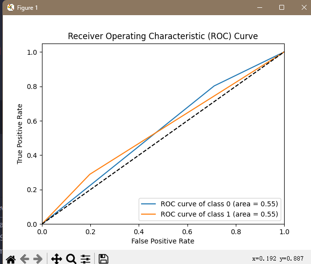

1k
训练ID3模型 start
训练ID3模型 success,training_time=0.012039422988891602
Prediction Time: 0.000005 seconds per sample
Accuracy: 0.66
Precision: 0.67
F1 Score: 0.66
Recall: 0.66
Confusion Matrix:
[[122  35]
 [ 33  10]]

训练C45模型 start
给定第(0, 1, 2, 3, 4, 5, 6, 7, 8, 9, 10, 11, 12, 13, 14, 15, 16, 17, 18, 19, 20, 21, 22, 23, 24, 25, 26, 27, 28, 29, 30, 31, 32, 33, 34, 35, 36, 37, 38, 39, 40, 41, 42, 43)特征为连续值特征
训练C45模型 success,training_time=4.099334716796875
Prediction Time: 0.000010 seconds per sample
Accuracy: 0.77
Precision: 0.65
F1 Score: 0.69
Recall: 0.77
Confusion Matrix:
[[152   5]
 [ 42   1]]

训练CART模型 start
训练CART模型 success,training_time=0.015226364135742188
Prediction Time: 0.000008 seconds per sample
Accuracy: 0.71
Precision: 0.71
F1 Score: 0.71
Recall: 0.71
Confusion Matrix:
[[128  29]
 [ 29  14]]

1w
load data,cache=False,isPart=True
read  C:\Users\yegetables\PycharmProjects\pythonProject\last\loan/data/train_part.csv (10000, 47)
训练ID3模型 start
训练ID3模型 success,training_time=0.153472900390625
Prediction Time: 0.000001 seconds per sample
Accuracy: 0.70
Precision: 0.71
F1 Score: 0.70
Recall: 0.70
Confusion Matrix:
[[1280  315]
 [ 288  117]]

训练C45模型 start
给定第(0, 1, 2, 3, 4, 5, 6, 7, 8, 9, 10, 11, 12, 13, 14, 15, 16, 17, 18, 19, 20, 21, 22, 23, 24, 25, 26, 27, 28, 29, 30, 31, 32, 33, 34, 35, 36, 37, 38, 39, 40, 41, 42, 43)特征为连续值特征
训练C45模型 success,training_time=134.62773299217224
Prediction Time: 0.000007 seconds per sample
Accuracy: 0.79
Precision: 0.71
F1 Score: 0.71
Recall: 0.79
Confusion Matrix:
[[1580   15]
 [ 396    9]]

训练CART模型 start
训练CART模型 success,training_time=0.14552664756774902
Prediction Time: 0.000001 seconds per sample
Accuracy: 0.71
Precision: 0.71
F1 Score: 0.71
Recall: 0.71
Confusion Matrix:
[[1290  305]
 [ 281  124]]

10w
load data,cache=False,isPart=True
read  C:\Users\yegetables\PycharmProjects\pythonProject\last\loan/data/train_part.csv (100000, 47)
训练ID3模型 start
训练ID3模型 success,training_time=1.8557658195495605
Prediction Time: 0.0000003257 seconds per sample
Accuracy: 0.70
Precision: 0.71
F1 Score: 0.71
Recall: 0.70
Confusion Matrix:
[[12929  3020]
 [ 2890  1161]]
AUC for class 0: 0.55
AUC for class 1: 0.55

训练C45模型 start
给定第(0, 1, 2, 3, 4, 5, 6, 7, 8, 9, 10, 11, 12, 13, 14, 15, 16, 17, 18, 19, 20, 21, 22, 23, 24, 25, 26, 27, 28, 29, 30, 31, 32, 33, 34, 35, 36, 37, 38, 39, 40, 41, 42, 43)特征为连续值特征
训练C45模型 success,training_time=5488.210168600082
Prediction Time: 0.0000063723 seconds per sample
Accuracy: 0.80
Precision: 0.71
F1 Score: 0.71
Recall: 0.80
Confusion Matrix:
[[15907    42]
 [ 4028    23]]

训练CART模型 start
训练CART模型 success,training_time=1.8647754192352295
Prediction Time: 0.0000004013 seconds per sample
Accuracy: 0.71
Precision: 0.71
F1 Score: 0.71
Recall: 0.71
Confusion Matrix:
[[12940  3009]
 [ 2885  1166]]
AUC for class 0: 0.55
AUC for class 1: 0.55
